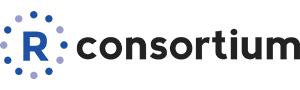

# satRday proposal
 

This repository is for the development of a proposal for the R Consortium around the development of community events, and a platform to manage them. 

## Get involved!
There are three ways to get involved:

- Read our docs at [satRdays.org](http://planning.satrdays.org)
- Have your say in the [Issues section](https://github.com/stephlocke/RSaturday-proposal/issues)
- Register your interest on the [survey](http://goo.gl/forms/Xv7mym0BwJ)

## About
This proposal surrounds support for smaller, but more frequent conferences, that are run by user groups in an area. They allow for growth of the user base whilst making access to speakers and content much easier by bringing the content to an area.

There is an existing model in the SQL Server world, called a SQL Saturday, which is a free conference on the weekend, run by the local user group. These have a central infrastructure supported and developed by the Professional Association for SQL Server. This proposal will use these as a starting point but will develop a community event that fits the R community and where we would like to grow it.

@stephlocke outlined the idea initially in a blog [SQLSaturdays but for R?](http://itsalocke.com/sqlsaturdays-but-for-r/) and raised the idea at the [R Consortium](https://www.r-consortium.org/) panel at [EARL Boston](http://www.earl-conference.com/boston/agenda/) receiving initial support the idea. We now just have to decide what we want to do :-)

## Background 

Set up in 2015, the R Consortium is an organisation set up to help support the R Foundation, the R Community, and R users.

> The primary purpose of the R Consortium (collectively, the “Purpose”) is to: 
>
>(a) advance the worldwide promotion of and support for the R open source language and environment as the preferred language for statistical computing and graphics (the “Environment”);
>
>(b) establish, maintain, seek support for, and develop infrastructure projects and technical and infrastructure collaboration initiatives related to the Environment, and such other initiatives as may be appropriate to support, enable and promote the Environment; 
>
>(c) encourage and increase user adoption, involvement with, and contribution to, the Environment; 
>
>[...]
>
>In furtherance of these efforts, the R Consortium shall seek to solicit the participation of all interested parties on a fair, equitable and open basis.
> *[R Consortium Bylaws, Section 1.4](https://www.r-consortium.org/about/governance/bylaws)*

Community growth and support make up a significant portion of the R Consortium goals. They're here to help us build the community, so let's build the community!

## Code of Conduct
Please note that this project is released with a [Contributor Code of Conduct](CONDUCT.md). By participating in this project you agree to abide by its terms.
